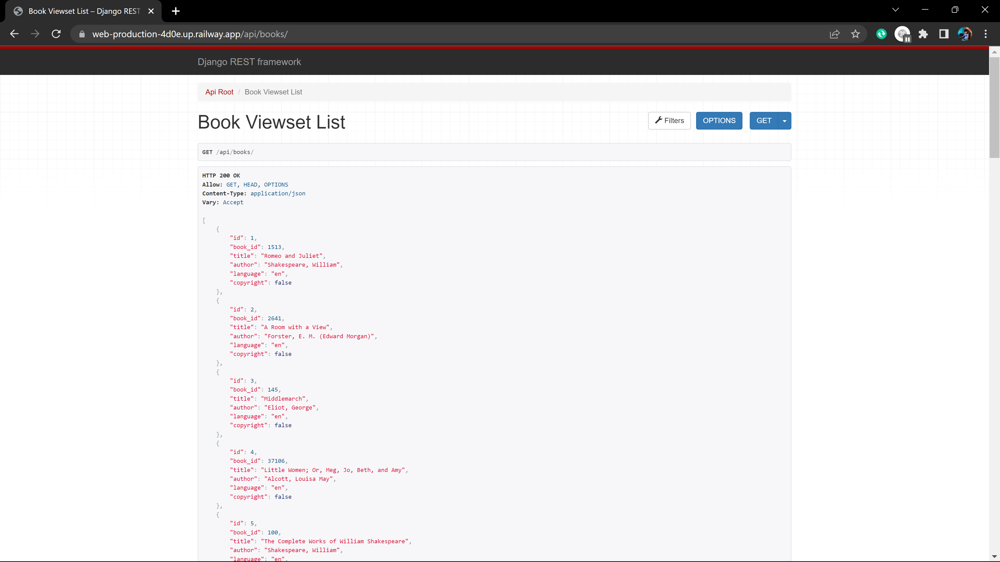

## Bookshelf_2Dchallenge

The challenge was to create an API that accesses data from a public API, parses it and displays it in a meaningful way.

## Choice of API

I chose **Gutenberg API** which provides a data in from of an array of objects which represents a books with title specific book ID and authors. [Here is the link to the website](https://www.gutenberg.org/)

## Development

### Backend

The Backend is built using python django and django rest framework to create apis.

#### Steps

1. Initializing the project using django-admin
2. Installing the required libraries e.g rest_framework,and all the dependancies
3. Creating the models responsible for interacting with the database. Used SQLlite database which makes it easier to deploy 
4. configuring the Request library to make requests to the gutenberg API and get the data. The function to make requests is stored in a separate module and only called to make the request. 
5. creating the serializers to serialize the models.
   
6. Creating the views responsible for controlling the app and returning response. I used modal viewsets to make work easier and prevent writing more code which is bug prone.
   
7. Finally creating the URLs which rendered the API fine 

### FrontEnd

#### steps

1. Created the front-end using Vite and React.- used vite which offers hot module replacement and it is faster than create react app.
2. Created a basic component to handle displaying of the books,filtering,sorting and searching
   

## Deployment

- deployed the backend to Railways for free and here is the [here](https://web-production-4d0e.up.railway.app/api/books)
- deployed the front-end to gh pages in github here is the link [here](https://koryanman.github.io/Bookshelf_2Dchallenge)
  

## Technologies Used

- React front-end
- Django backend

## Installation

1. clone the repository to your local machine
   - #### Front-end
     ` yarn`
     ` yarn dev`

- #### Backend
  `pipenv install`
  `pipenv shell`
  > to activate environment
  > `python manage.py runserver`
  > to start the web server

## Contributing

If you'd like to contribute to the project, please follow these steps:

1. Fork the repository and clone it to your local machine.
2. Create a new branch for your changes.
3. Make your changes and test them thoroughly.
4. Push your changes to your fork.
5. Submit a pull request to the main repository.

## License

This project is licensed under the MIT License. See the LICENSE file for more information.
